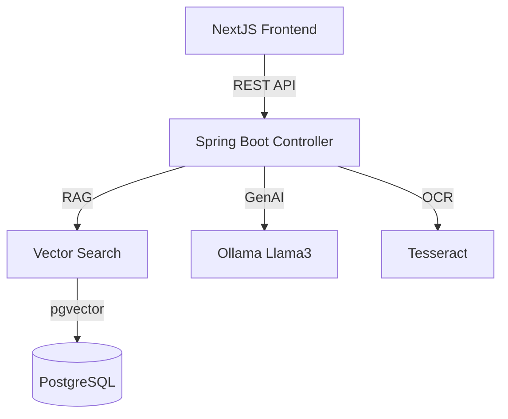

# Walkthrough - TestPilot AI Premium GUI

I have successfully integrated a state-of-the-art NextJS interface with a Spring Boot RAG backend. The system is designed for high-impact demonstrations and reliable automated test case generation.

## Visual & UX Enhancements
- **Immersive Design**: A deep dark-mode theme with glassmorphism and animated ambient gradients that fill the entire browser frame.
- **Tailwind v4 Integration**: Leveraged the latest Tailwind CSS for high-performance styling and custom design tokens.
- **Responsive Layouts**: Fixed spacing and alignment issues to ensure the UI looks premium on all screen sizes.

## Core Capabilities

### 1. Advanced Generation
- **Dual Mode**: Switch between text-only user stories and multimodal (Text + UI Screenshot) generation.
- **RAG-Powered**: The AI retrieves relevant context from your documentation to ensure scenarios are grounded in reality.
- **Rich Results**: Detailed test cases with preconditions, numbered execution steps, and verifiable outcomes.

### 2. Knowledge Base Management
- **Repository Audit**: A dedicated view to list all ingested PDFs.
- **Chunk Inspection**: Peek "under the hood" to see how the system indexes your documents into searchable context shards.
- **In-Browser Upload**: Direct drag-and-drop ingestion of technical requirements.

### 3. Professional Exports
- **Excel Output**: One-click export of generated test cases into a structured spreadsheet.

## Getting Started

1. **Backend**:
   - Directory: `testpilot-ai`
   - Command: `mvn clean spring-boot:run`
   - *Note: Ensure PostgreSQL with pgvector and Ollama are running.*

2. **Frontend**:
   - Directory: `testpilot-ui`
   - Command: `npm install` followed by `npm run dev`
   - Access: `http://localhost:3000`

## System Architecture

